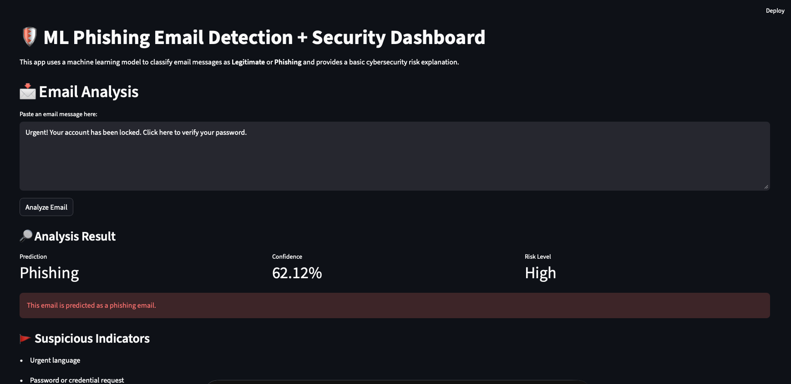
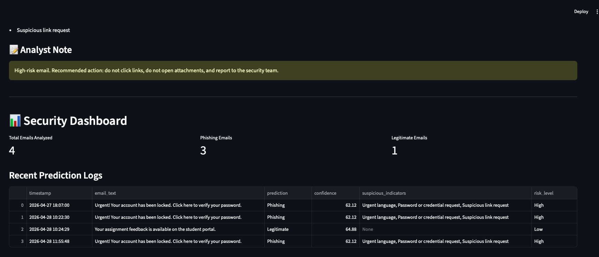

# ML Phishing Email Detection + Security Dashboard

## About This Project

This project is a hands-on cybersecurity and machine learning project that focuses on detecting phishing emails.

Phishing is one of the most common cyber threats, where attackers send fake emails to trick people into clicking malicious links, sharing passwords, downloading harmful attachments, or giving away sensitive information. In this project, I built a machine learning-based phishing email detector that analyzes the text of an email and predicts whether it is **Legitimate** or **Phishing**.

The project includes both the machine learning model and a simple Streamlit web application. The app allows a user to paste an email message, analyze it, view the prediction, see the confidence score, check suspicious indicators, and review a security dashboard.

This project helped me connect machine learning concepts with real cybersecurity use cases such as phishing detection, risk scoring, suspicious indicator analysis, logging, and dashboard reporting.

---

## Project Goal

The main goal of this project is to build a simple but practical phishing email detection tool using machine learning.

The project is designed to answer questions such as:

- Can a machine learning model classify an email as legitimate or phishing?
- What words or phrases make an email suspicious?
- How can prediction results be explained in a cybersecurity-friendly way?
- How can email analysis results be logged for review?
- How can dashboard metrics help summarize phishing detection activity?

---

## Why This Project Matters

Phishing emails are still one of the easiest ways attackers can target individuals and organizations. Even one successful phishing email can lead to account compromise, credential theft, malware infection, or data loss.

This project is useful because it demonstrates how machine learning can support phishing detection by identifying patterns in email text. It also adds a cybersecurity explanation layer by checking for suspicious indicators such as urgent language, password requests, account threats, suspicious links, financial requests, and reward-based lures.

The project is not meant to replace enterprise email security tools, but it shows the basic idea behind how automated phishing detection and risk analysis can work.

---

## Tools and Technologies Used

| Tool / Technology | Purpose |
|---|---|
| Python | Main programming language used for the project |
| Pandas | Used for dataset handling, CSV files, and prediction logs |
| Scikit-learn | Used for TF-IDF vectorization, model training, and evaluation |
| Logistic Regression | Machine learning classification model used to classify emails |
| TF-IDF Vectorizer | Converts email text into numerical features for the model |
| Joblib | Saves and loads the trained model and vectorizer |
| Streamlit | Builds the interactive web app and dashboard |
| Jupyter Notebook | Used for model training, testing, and experimentation |
| VS Code | Used to build the Streamlit app and project files |
| GitHub | Used to publish and document the project |

---

## Project Features

The final application includes the following features:

- Classifies email messages as **Legitimate** or **Phishing**
- Uses TF-IDF vectorization to convert email text into machine-readable features
- Uses a Logistic Regression model for binary classification
- Displays the model prediction
- Shows the model confidence score
- Detects suspicious phishing indicators
- Assigns a risk level: **Low**, **Medium**, or **High**
- Provides a short analyst-style recommendation
- Saves prediction results into a CSV log file
- Displays a security dashboard with summary metrics
- Shows recent prediction logs
- Displays prediction count charts
- Displays risk-level count charts
- Shows a preview of the training dataset

---

## Dataset Description

The dataset used in this project contains sample email messages and a label for each email.

| Label | Meaning |
|---|---|
| 0 | Legitimate email |
| 1 | Phishing email |

The dataset contains two types of emails:

### Legitimate email examples

These are normal, safe messages such as:

- Student portal updates
- Library announcements
- Course registration messages
- Academic reminders
- College service notifications

### Phishing email examples

These are suspicious messages that include phishing-style language such as:

- Urgent account warnings
- Password verification requests
- Suspicious links
- Fake prize or gift claims
- Banking or billing requests
- Account suspension threats
- Attachment-related warnings

The dataset file used in the project is:
phishing_dataset.csv

## Screenshots

### Phishing Email Analysis Result



### Security Dashboard



### Example 1: Legitimate Email

Your assignment feedback is available on the student portal.

Expected output

Prediction: Legitimate
Risk Level: Low

Reason:

This email does not contain major phishing indicators and looks like a normal academic notification.

### Example 2: Phishing Email

Urgent! Your account has been locked. Click here to verify your password.

### Expected output

Prediction: Phishing
Risk Level: High

### Reason:

This email contains urgent language, an account threat, a suspicious link request, and a password-related request.


## Project Files

| File | Description |
|---|---|
| `app.py` | Streamlit web application |
| `phishing_model_training.ipynb` | Jupyter notebook used for model training and testing |
| `phishing_dataset.csv` | Dataset containing email text and labels |
| `phishing_model.pkl` | Saved trained Logistic Regression model |
| `tfidf_vectorizer.pkl` | Saved TF-IDF vectorizer |
| `prediction_logs.csv` | CSV file containing prediction logs |
| `requirements.txt` | List of Python packages needed to run the project |
| `.gitignore` | Specifies files and folders not uploaded to GitHub |
| `README.md` | Project documentation |

---

## How to Run This Project

### 1. Install the required packages

```bash
pip install -r requirements.txt

# 2. Run the Streamlit app

streamlit run app.py

3. Open the local Streamlit URL

After running the app, Streamlit will show a local URL such as:

http://localhost:8501

Open the URL in a browser to use the application.
 

## Limitations

This project is created for learning and portfolio purposes. It has some limitations:

- The dataset is small and custom-made.
- The model is not trained on a large real-world phishing dataset.
- The confidence score may not always be high.
- The model may not detect advanced phishing techniques.
- The suspicious indicator logic is rule-based.
- Real phishing emails can use more complex language and evasion techniques.

Because of these limitations, this project should not be used as a production security tool without further testing and improvement.


### Future Improvements

Possible future improvements include:

- Train the model using a larger public phishing email dataset.
- Compare multiple models such as Naive Bayes, SVM, Random Forest, and deep learning models.
- Add URL feature extraction.
- Detect suspicious domains and shortened links.
- Add attachment risk analysis.
- Improve text preprocessing.
- Add model explainability.
- Add downloadable security reports.
- Add user-uploaded email file analysis.
- Deploy the Streamlit app online.


## Skills Demonstrated

This project demonstrates the following skills:

- Machine Learning
- Cybersecurity
- Phishing Detection
- Text Classification
- TF-IDF Vectorization
- Logistic Regression
- Model Evaluation
- Confusion Matrix Analysis
- Python Programming
- Pandas
- Scikit-learn
- Streamlit
- Jupyter Notebook
- CSV Logging
- Risk Classification
- Security Dashboard Development
- GitHub Documentation

## What I Learned

Through this project, I learned how to connect machine learning with a real cybersecurity use case. I practiced building a text classification model, evaluating it with proper metrics, saving the model, and using it inside a Streamlit application.

I also learned how important it is to explain model predictions in a security-friendly way. Instead of only showing “Phishing” or “Legitimate,” the app also shows suspicious indicators, risk level, analyst notes, and dashboard logs.

This made the project more practical and closer to how cybersecurity teams think about detection, evidence, and risk.

## Author

Created by Swathi Meenakshi Sundaram.


## License

This project is shared for educational and portfolio purposes. Please give proper credit if you reference or reuse any part of this project.


